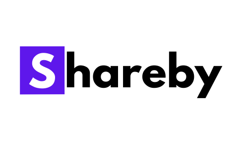

<p align="center">
  <a href="https://shareby.herokuapp.com">
    
  </a>
  <h3 align="center">
  Write code, notes and share with others!
  </h3>
</p>

[](https://www.codacy.com/gh/rohitbakoliya/shareby/dashboard?utm_source=github.com&utm_medium=referral&utm_content=rohitbakoliya/shareby&utm_campaign=Badge_Grade)


## Quick Start

```sh
$ git clone https://github.com/rohitbakoliya/shareby.git
$ cd shareby
$ yarn install
$ cd client & yarn install
$ yarn dev
```

**NOTE:** Dont' forget to create `.env` by copying the content of `.env.example` and updating with
valid keys

## Technologies used

- Node.js
- Express.js
- React.js
- MongoDB
- Heroku
- Ant Design
- Styled Components

## Features

- Awesome UI
- Vs Code like Editor
  - Dark Mode
  - Options to use custom editor configuration and they can be saved locally
  - You can export code
  - Code image generation right from the editor
  - Markdown rendering
- Text editor
  - Basic WYSIWYG Editor options
  - Youtube, Codepen can be embeded
  - You can export the editor text as HTML or Markdown
- Generates a unique link to share code/text, and shared code/text can be viewed later on by that
  link
- You can also protect code/text sharing by password

  ## Author

  - Rohit Bakoliya - [rohitbakoliya](https://github.com/rohitbakoliya)
